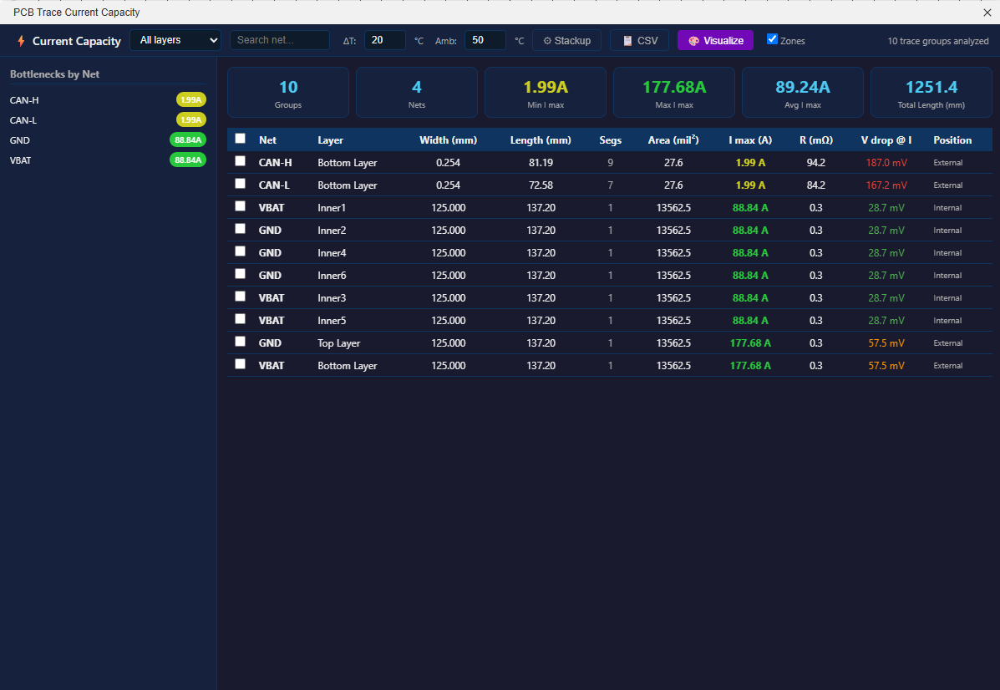
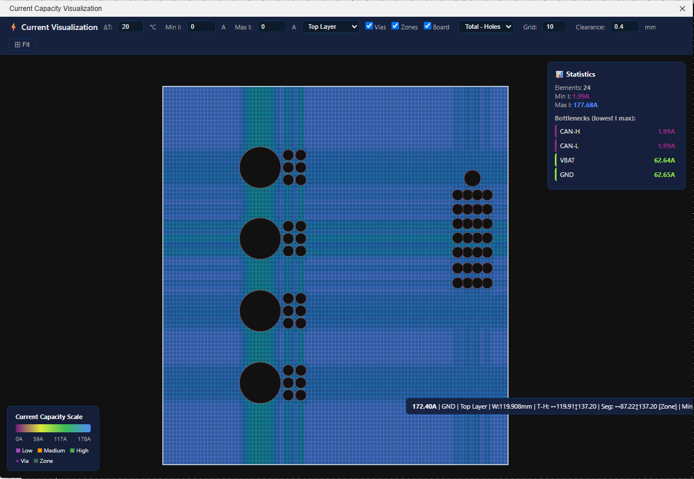
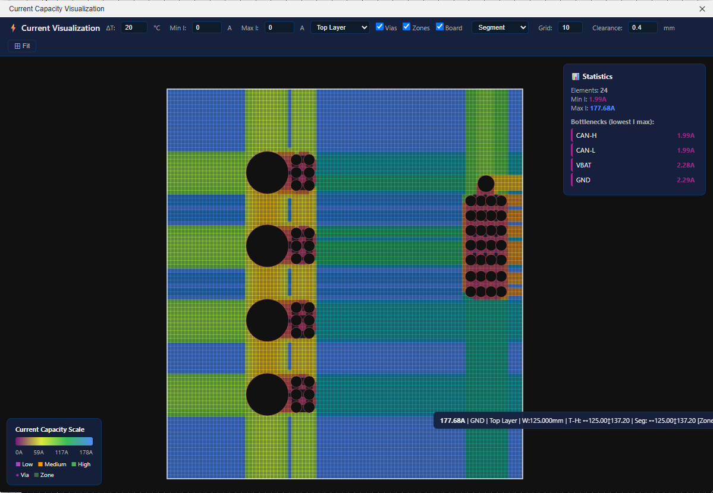

# PCB Trace Current Capacity Calculator

Extension for **EasyEDA Pro** that calculates the maximum current capacity of each PCB trace based on the **IPC-2221B** standard, including 2D canvas visualization.







## Features

- **IPC-2221B Calculation** — `I = k × ΔT^0.44 × A^0.725` (k=0.048 outer, k=0.024 inner)
- **Copper layer filtering** — only copper layers are processed (Top, Bottom, Inner), excluding silkscreen, soldermask, paste, etc.
- **JLCPCB Presets** — pre-configured copper thicknesses (2L 1oz, 2L 2oz, 4L 1oz, 4L 2oz, 6L 1oz)
- **Sortable table** — Net, Layer, Width, Length, Segments, Area (mil²), I max, Resistance, Voltage drop, Position
- **Summary cards** — Groups, Nets, Min/Max/Avg I max, Total length
- **Bottleneck sidebar** — nets sorted by lowest maximum current
- **Layer filter and search** — filter traces by layer or search by net name
- **Min/Max I filter** — limit visualization by current range
- **CSV export** — export the complete table
- **Canvas Visualization** — 2D heatmap with dynamic current scale
  - Mouse pan/zoom
  - Hover with trace details (current, net, layer, width)
  - Net selection (click on bottleneck or trace)
  - Dynamic color scale based on actual PCB maximum current
  - Filters: ΔT, Min I, Max I, Layer, Vias
  - Adaptive legend

## Formulas

| Calculation | Formula |
|---|---|
| Maximum current | `I = k × ΔT^0.44 × (W × T)^0.725` |
| Resistance | `R = ρ × L / (W × T)` with temperature-adjusted ρ |
| Voltage drop | `V = I × R` |
| Temperature rise | Inverted IPC-2221B formula |

Where:
- `k` = 0.048 (outer layer), 0.024 (inner layer)
- `W` = trace width (mil)
- `T` = copper thickness (mil)
- `ΔT` = temperature rise above ambient (°C)
- `ρ` = copper resistivity: 1.724×10⁻⁵ Ω·mm at 20°C, α = 3.93×10⁻³/°C

## Structure

```
easyeda-current-capacity/
├── extension.json          # Extension manifest
├── dist/
│   └── index.js            # Entry point — PCB data extraction
├── iframe/
│   ├── index.html          # Main UI — table, cards, settings
│   ├── current-calc.js     # IPC-2221B calculation engine
│   └── current-viz.html    # 2D canvas visualization
└── README.md
```

## Build

Generate the `.eext` package (PowerShell):

```powershell
Add-Type -AssemblyName System.IO.Compression.FileSystem
Add-Type -AssemblyName System.IO.Compression

$src = "path\to\easyeda-current-capacity"
$out = "current-capacity-calculator.eext"

$zip = [System.IO.Compression.ZipFile]::Open($out, [System.IO.Compression.ZipArchiveMode]::Create)
Get-ChildItem -Path $src -Recurse -File | ForEach-Object {
    $entry = $_.FullName.Substring($src.Length + 1).Replace('\', '/')
    [System.IO.Compression.ZipFileExtensions]::CreateEntryFromFile(
        $zip, $_.FullName, $entry,
        [System.IO.Compression.CompressionLevel]::Optimal) | Out-Null
}
$zip.Dispose()
```

> Replace `$src` with the actual path to the project folder.

## Installation

1. Build the `.eext` file using the script above
2. In EasyEDA Pro: **Extensions → Extension Manager → Load from local**
3. Select the `.eext` file

## Usage

1. Open a PCB in EasyEDA Pro
2. Menu: **Current Capacity → Calculate Current Capacity...**
3. Configure ΔT and copper thickness in the Settings panel
4. Click **Visualize** to open the heatmap

## Changelog
### v1.10.0
- **Board outline arc support** — EasyEDA Pro uses a 3-parameter ARC format (`ARC, arcAngle, endX, endY`) for rounded corners in board outlines. New `_approxArcEda()` function correctly approximates these arcs, so boards with rounded corners now display the correct outline shape.
- **R-rectangle rotation fix** — the `"R"` polygon format (`R, x, y, w, h, rotation, cornerRadius`) now uses origin-based rotation: the rectangle extends from `(x,y)` with width right and height downward, then rotates around the origin. Fixes pour/fill positioning and angle for rotated zones.
- **Board clip always active** — zone clipping to the board outline is now always applied, regardless of the "Show Outline" checkbox state. Previously, zones could visually extend beyond the board when the outline was hidden.
- **Removed debug button** — the `🐛 Debug` button and overlay (with JSON dump and copy) have been removed from the canvas visualization.

### v1.9.1
- **Color scale update** — replaced red/dark-red tones with purple/magenta gradient for low-current areas. Red implied a problem, but low current capacity is not inherently bad.
- **Loading overlay** — spinner with "Loading PCB data…" while the visualization canvas processes data, preventing a blank white screen.
- **Removed debug buttons** — debug export buttons removed from both the main UI and the canvas visualization.

### v1.9.0
- **Board outline clipping for Fills** — `pcb_PrimitiveFill` is now clipped to the board outline (Sutherland-Hodgman), same as Pours. Fills that extended beyond the board (raw API coordinates) now appear at the correct size.
- **Arc width fix** — the `pcb_PrimitiveArc.lineWidth` API returns a default value (10 mil) for all arcs. Implemented width inheritance: arcs inherit the width from the connected line segment (same net/layer, endpoint with 5µm snap). A second pass propagates to chained arcs (arc→arc→line).
- **"Zones" checkbox** — added to the main page (table) and canvas visualization, both unchecked by default. When unchecked, zones are excluded from the table, cards, sidebar, legend, statistics, and bottleneck list. The color scale and `globalMaxI` are dynamically recalculated.
- **Expanded debug** — `arcSamples` (10 arcs with width/iMax/segs), `lineSamples` (5 lines), `widthDistribution` (unique widths with count), `arcWidthFix` (fix stats), `rawSamples` with ALL API properties for Arc/Line/Pad/Pour/Fill, `_rawPoly`/`_rawBounds` for Fills.

### v1.5.0
- **2D grid heatmap** — replaced the strip analysis (H/V strips + dropdown) with a 30×30 grid that automatically calculates `min(width↔, height↕)` per cell. Each zone cell receives the IPC-2221B current based on the smallest dimension (bottleneck), with no need to switch direction.
- **Automatic visualization** — removed the flow direction dropdown (↕/↔/Min). The visualization now shows the worst case at each point automatically.
- **Hover with dimensions** — hovering over a zone shows the cell current + horizontal width (↔) + vertical height (↕) + zone minimum current.

### v1.4.0
- **Strip-based current analysis** — zones/pours are sliced into 40 horizontal and vertical strips. Each strip measures the actual copper width at that position using scan-line on the polygon, calculating IPC-2221B current individually. Identifies bottlenecks in shapes like "C", "L", "T", etc.
- **Flow direction selector** — dropdown in visualization: ↕ Vertical flow (horizontal strips), ↔ Horizontal flow (vertical strips), or Min (bottleneck) showing the worst case from both directions.
- **Per-strip heatmap** — each zone strip is independently colored by its current, visually revealing where the pour is narrow (red) vs wide (green).
- **Local current on hover** — hovering over a zone shows the specific strip current + effective width + minimum current (bottleneck) of the entire zone.
- **Point-in-polygon** — hover detection now uses ray-casting instead of bounding box, accurate for non-rectangular polygons.
- **Table selection checkboxes** — each table row has a checkbox for individual trace selection, with Select All in the header.
- **Selection card (⚡)** — when traces are selected, displays summed total current (for parallel traces on multiple layers), equivalent parallel resistance, and detailed list.
- **PCBs without traces** — extension now opens normally on PCBs that only have copper pours/fills (no traces).

### v1.3.0
- **`complexPolygon` parser** — EasyEDA Pro pours and fills use `complexPolygon.polygon` (array of coordinates + "L"/"R" commands) instead of `bounds`. New parser extracts polygon points, calculates bounding box and area via Shoelace formula. Supports generic polygons and rectangles ("R").
- **Copper Fill support** — dedicated extraction of `pcb_PrimitiveFill` with `complexPolygon` parsing, now processed as zones with current calculation.
- **Fixed copper layer detection** — replaced keyword-based detection (which included Hole, 3D Shell, Ratline, Stiffener as copper) with a fixed whitelist: IDs 1 (Top), 2 (Bottom), 15-46 (Inner1-32). Validated against actual API layers.
- **Debug button (🐛)** — displays all raw extracted data in JSON (samples, tested APIs, zones), with Copy button.
- **Extra API probing** — automatically tests `pcb_PrimitiveSolidRegion`, `pcb_PrimitiveRegion`, `pcb_PrimitivePolygon`, `pcb_PrimitiveCopper`, `pcb_PrimitiveCopperArea`, `pcb_PrimitiveCircle`, `pcb_PrimitiveRect`, `pcb_PrimitiveTrack`, `pcb_PrimitiveShape`. APIs with `complexPolygon` or bounds+copper are added as zones.
- **Raw samples** — each primitive (Line, Arc, Via, Pad, Pour, Fill + extras) stores a complete sample of API properties, visible in Debug.
- **Zones on canvas and table** — copper pours/fills now appear with correct polygon (no longer an empty rectangle), including current calculation, hover, and visualization.

### v1.2.0
- **Improved copper layer detection** — added `'pin'` and `'float'` to the non-copper keywords list, fixing the incorrect inclusion of the "Pin Floating Layer"
- **Fixed canvas (180°)** — Y-axis inverted in `worldToScreen`/`screenToWorld` for correct top-down orientation (matching EasyEDA)
- **Fixed vertical drag** — vertical drag direction adjusted to match Y-axis inversion
- **Max I in textbox** — the Max I field now displays the actual maximum current as placeholder when empty
- **Simplified stackup** — removed JLCPCB presets dropdown; copper thickness is now entered directly in **oz** (outer and inner), with automatic conversion to mm (1 oz = 0.035 mm)
- **Stackup compatibility** — loads saved settings in the old format (mm) and converts to oz

### v1.1.0
- Improved copper layer filtering — excludes silkscreen, soldermask, paste, and other non-copper layers by keywords
- Canvas visualization: dynamic current scale based on actual maximum current (instead of fixed 10A/15A)
- Canvas visualization: legend with adaptive values
- Canvas visualization: copper-only filter in all functions (draw, fitView, recalculate, findTraceAt, populateFilters)
- Added **Max I** filter in visualization toolbar
- Legend bar gradient uses actual maximum current quartiles

### v1.0.0
- Initial release
- Complete IPC-2221B calculation (max current, resistance, voltage drop, temperature rise)
- JLCPCB presets (2L/4L/6L, 1oz/2oz)
- Sortable table with bottleneck sidebar
- 2D canvas visualization with pan/zoom and hover
- CSV export

## License

MIT
